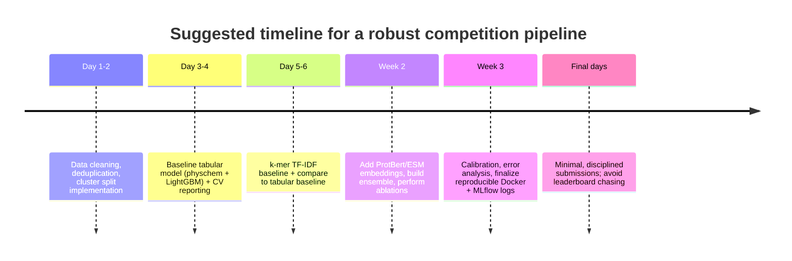

# Designing a Complete, Reproducible Pipeline for Peptide Binary Classification Competitions

## Executive summary

A peptide binary classification competition (labels **+1** vs **−1**) scored by **ROC-AUC** rewards two things: (i) representing short biological sequences in ways that capture compositional, physicochemical, and contextual patterns; (ii) running evaluation that matches the hidden test distribution while resisting *leaderboard overfitting*. The competition description in your screenshot also indicates a **public/private leaderboard split (2/3 vs 1/3)** and explicitly warns participants to avoid over-optimization, which makes robust offline validation central to success.

A reproducible “competition-grade” approach is therefore a **multi-view pipeline**:

- **Data discipline first**: strict cleaning, de-duplication, and sequence-similarity-aware splitting (cluster splits) to avoid inadvertent leakage from near-identical peptides.
- **Feature diversity**: start with fast, strong baselines (composition + physicochemical descriptors + k-mers), then add **pretrained protein language model embeddings** (e.g., ProtBert and ESM-style encoders) to capture higher-order patterns from large unlabeled corpora. citeturn2search0turn2search2turn2search3turn2search1
- **Model diversity + ensembling**: combine gradient-boosted trees on engineered descriptors with neural models (CNN/RNN/Transformer heads over one-hot or embeddings). Ensembling is typically the largest single gain after good validation.
- **Leaderboard-safe evaluation**: use (a) **clustered stratified k-fold CV** for model selection, (b) an untouched **shadow “private LB” holdout** (~1/3) to mimic the private split, and (c) optionally **nested CV** for unbiased hyperparameter tuning.
- **Probability quality**: since ROC-AUC uses scores not hard labels, focus on calibrated probabilities, report PR-AUC and calibration diagnostics, and choose thresholds only at the very end for label submission.
- **Reproducibility and integrity**: pin environments (Docker), track experiments (MLflow), version data (DVC or immutable hashes), and follow competition rules on team naming and confidentiality.

Compute budget is **unspecified**; recommendations below note relative cost and provide lightweight-to-heavy options under that assumption.

## Problem framing and assumptions

The screenshot states: training data contains peptide **sequence + label**, test data contains **sequence only**, prediction is **+1 vs −1**, and evaluation is **AUC (ROC)** with **2/3 public** and **1/3 private** leaderboard split; private leaderboard is revealed after competition ends. It also includes strict participation rules about **team naming (Group_ID)** and not sharing the competition link.

Because the dataset schema and biological meaning of “positive” are not shown, the methodology below is designed to work in two regimes:

- **Closed-data regime (default, safest)**: use only the organizer-provided train set for supervised learning; use public resources only for *generic, unlabeled pretraining* (or not at all), avoiding any risk of rules violations.
- **Open-data regime (conditional)**: if the competition explicitly allows external labeled data, augment training with domain datasets (AMP/therapeutic peptide databases) and build external validation sets. This regime must include duplicate/near-duplicate removal against the provided train/test to avoid leakage and fairness issues.

Where a detail is unspecified (submission format, external data policy, class balance, max sequence length), I state an assumption and provide alternatives.

## Data sources for training, augmentation, and external validation

### How to use external sources without breaking competition integrity

External sources can help in three **legitimate** ways:

1. **Unlabeled corpora for representation learning** (always low-risk): pretrained embeddings (ProtBert/ESM) already internalize this, so you often do not need to download millions of sequences yourself. citeturn2search0turn2search1turn2search3turn2search2  
2. **External validation** (low-risk): evaluate your trained model on an independent dataset *not used for training* as a sanity check for domain shift (you still select final hyperparameters by your internal CV).  
3. **Training augmentation with labeled external peptides** (high-value but rule-sensitive): only if rules explicitly allow it; then aggressively de-duplicate and use similarity-aware splits.

### Candidate datasets and what they’re good for

| Source | Primary content | Typical scale / notes | Best use in competitions | Access and licensing notes |
|---|---|---:|---|---|
| entity["organization","UniProtKB","protein knowledgebase"] | Protein sequences + annotations | UniProt releases and provides bulk downloads + APIs citeturn0search15turn0search22 | Unlabeled corpus; negative sampling; annotation-derived weak labels (only if rules allow) | UniProt applies **CC BY 4.0** to copyrightable parts (attribution required). citeturn0search4 |
| entity["organization","RCSB Protein Data Bank","3d protein structure archive"] | Experimentally determined 3D structures; includes peptides/chains | Hundreds of thousands of structures; bulk download supported citeturn7view4turn0search23 | Optional structural feature extraction; external validation on structured peptides | PDB core archive moved to **CC0** (public domain dedication). citeturn7view5 |
| APD / APD3 (Antimicrobial Peptide Database) | Curated natural AMPs | Published descriptions emphasize curated natural AMPs; APD3 papers report thousands of entries citeturn0search9turn0search17 | External validation; positive-class augmentation if “positive” ≈ antimicrobial and rules allow | Site provides download links (tool access may be intermittent); check site availability and terms. citeturn0search6turn0search2 |
| entity["organization","CAMPR4","antimicrobial peptide db r4"] | Natural + synthetic AMPs; includes modifications | CAMP R4 reports **24,243 sequences** and **933 structures**; site shows natural/synthetic counts citeturn10search4turn13view2 | AMP augmentation; domain-shift validation between natural vs synthetic subsets | Public web resource; confirm any usage restrictions per site/paper. citeturn10search4turn13view2 |
| entity["organization","DBAASP.org","antimicrobial peptide activity db"] | AMPs with activity/toxicity + modifications + structures | DBAASP v3 reports **>15,700 entries** citeturn10search1 | AMP augmentation; multi-task signals (toxicity) for representation | Export supports FASTA/CSV via site; **terms include acknowledgement and constraints**—read carefully before redistribution. citeturn13view0turn14view0 |
| entity["organization","DRAMP","antimicrobial peptide repository"] | AMPs with clinical/patent info, stability, toxicity | DRAMP homepage: **30,260 entries**, CC BY 4.0; categorized downloads (FASTA/TXT/XLSX) citeturn13view3turn7view3 | AMP augmentation; external validation; subgroup generalization (plant/synthetic/stapled) | Explicitly states **CC BY 4.0**; notes patent peptides may require authorization. citeturn13view3turn7view3 |
| entity["organization","SATPdb","therapeutic peptide structure db"] | Therapeutic peptides + structural annotation | Paper describes downloadable sequences/structures and large structure set citeturn1search5turn1search25 | If label relates to therapeutic functions; external validation for structure-biased models | Download page available; use citations and check terms. citeturn1search5turn1search25 |
| entity["organization","IEDB","immune epitope database"] | Experimentally curated epitopes (peptides) | Funded resource with export and query APIs described citeturn1search3turn1search15turn1search23 | If label relates to immunogenicity/binding; external validation; hard negatives | Provides exports/API; confirm license/terms in IEDB documentation. citeturn1search15turn1search23 |
| LAMP2 (database linking AMPs) | Cross-links AMPs across databases | LAMP2 update describes **23,253 unique AMP sequences** and links to many AMP DBs citeturn1search2 | Deduplication hub and cross-database validation | Use primarily for linkage/curation; still confirm access terms. citeturn1search2 |

### Practical URL list (for reproducible referencing)

```text
UniProt (license): https://www.uniprot.org/help/license
UniProt (downloads/help): https://www.uniprot.org/help/downloads

RCSB PDB (downloads): https://www.rcsb.org/downloads
PDB CC0 license news: https://www.rcsb.org/news/feature/611e8d97ef055f03d1f222c6

APD / APD3 (home): https://aps.unmc.edu/
APD downloads: https://aps.unmc.edu/downloads

CAMP R4: https://camp.bicnirrh.res.in/
CAMP R3: https://camp3.bicnirrh.res.in/

DBAASP (home): https://dbaasp.org/
DBAASP export page: https://dbaasp.org/search
DBAASP terms PDF: https://dbaasp.org/docs/DBAASP_Terms_And_Conditions.pdf

DRAMP (home): https://dramp.cpu-bioinfor.org/
DRAMP downloads: https://dramp.cpu-bioinfor.org/downloads/

SATPdb (home): https://crdd.osdd.net/raghava/satpdb/
SATPdb download page: https://crdd.osdd.net/raghava/satpdb/down.php

IEDB (home): https://www.iedb.org/
IEDB Query API (IQ-API): https://help.iedb.org/hc/en-us/articles/4402872882189-Immune-Epitope-Database-Query-API-IQ-API
```

### Feature-extraction toolkits and baseline resources

If you need fast, standardized peptide descriptors, these are widely used:

- iFeature / iFeatureOmega: generates many common sequence encodings (AAC, CTD, PseAAC, autocorrelation, etc.). citeturn6search4turn6search0  
- Pfeature (IIITD/Raghava group): computes a broad range of protein/peptide features; also has a GitHub repo. citeturn6search1turn6search5turn6search9  
- propy3: Python package for many classical descriptors including CTD and PseAAC. citeturn6search3turn6search23  
- AMP Scanner v2 code/datasets (useful as a reference baseline for AMP-like labels). citeturn11search0turn11search22  

## Methodology for data preparation and feature engineering

### Data cleaning and standardization

Assumption: peptides are provided as one-letter amino acid strings. If modified/unusual residues appear, handle them explicitly (do not silently drop).

Recommended cleaning checklist:

- **Canonicalize case**: uppercase sequences; trim whitespace. (ProtBert model cards explicitly assume uppercase amino acids.) citeturn2search2turn2search5  
- **Validate alphabet**:
  - If strictly canonical: accept only {A,C,D,E,F,G,H,I,K,L,M,N,P,Q,R,S,T,V,W,Y}.
  - If ambiguous tokens (X, B, Z, U, O) appear: either map to X and use models that support it, or drop those rows and document the decision.
- **Length sanity checks**: remove empty sequences; set max length policy (e.g., truncate >Lmax for neural models; keep full length for k-mer/descriptor models).
- **Deduplicate**:
  - Exact duplicates: if the same sequence appears multiple times with the same label, keep one (or keep all but group them together for splitting).
  - Conflicting labels: treat as data issue; options include dropping, majority vote, or keeping but forcing the sequence to remain within one fold to avoid leakage.
- **Leakage guardrails** (critical in biology):
  - Cluster sequences by identity and ensure *clusters* (not individual sequences) are split across folds (details below). CD-HIT is a standard tool for redundancy reduction; MMseqs2 is a scalable alternative. citeturn3search0turn3search8turn3search9turn3search13  

### Workflow diagram (end-to-end)

```mermaid
flowchart TB
  A[Load train.csv / test.csv] --> B[Clean sequences: uppercase, alphabet, length]
  B --> C[Deduplicate + resolve conflicts]
  C --> D[Cluster peptides by sequence identity\n(CD-HIT / MMseqs2)]
  D --> E[Create splits\n- cluster-stratified k-fold\n- shadow private holdout]
  E --> F1[Feature view 1\nPhysicochemical + composition]
  E --> F2[Feature view 2\nk-mer / TF-IDF n-grams]
  E --> F3[Feature view 3\nPLM embeddings (ProtBert/ESM)\nmean/attn pooling]
  F1 --> G1[GBDT / linear models]
  F2 --> G2[linear-SVM / GBDT]
  F3 --> G3[CNN/RNN/Transformer head\nor MLP over embeddings]
  G1 --> H[Out-of-fold predictions]
  G2 --> H
  G3 --> H
  H --> I[Ensembling + calibration]
  I --> J[Final train all\n+ generate test scores]
  J --> K[Submission file\n(probability or label)]
```

### Feature engineering options and trade-offs

A strong competition strategy uses **multiple feature families** because peptide labels are often separable by different signals: composition/charge/hydrophobicity, motifs, and broader context.

| Feature set | What it captures | Typical dimensionality | Pros | Cons | Compute notes |
|---|---|---:|---|---|---|
| One-hot / “binary profile” (padded) | Exact residue identity + local motifs | Lmax × 20 | Great for CNNs; transparent | Needs fixed length; can overfit with small data | Fast on GPU; negligible on CPU |
| k-mer counts (n-gram) / TF-IDF | Short motifs and compositional patterns | 20^k (often hashed) | Very strong with linear models; works with small data | Sparse high-dim; sensitive to leakage from near-duplicates | CPU-friendly; memory can grow |
| AAC/DPC/TPC (composition) | Global composition | 20 / 400 / 8000 | Fast, robust baseline | Loses order info | Very fast CPU |
| Physicochemical descriptors | Charge, pI proxies, hydrophobicity, MW, aliphaticity, etc. | 10–500+ | Often highly predictive for peptide activity | Requires careful definition; may miss motifs | Very fast CPU |
| CTD / PseAAC / autocorrelation | Global + sequence-order statistics | 100–1000+ | Standard bioinformatics encoders; good with SVM/GBDT | Parameter choices matter; can be redundant | Fast CPU; many tools automate this citeturn6search3turn6search23turn6search0 |
| PLM embeddings (ProtBert / ESM) pooled | Contextual residue patterns learned from massive corpora | 768–1280+ | Often best single representation when data is small; easy transfer | Requires GPU for speed; needs careful pooling | Embedding extraction is moderate; fine-tuning is heavy citeturn2search0turn2search2turn2search3turn2search1 |
| Optional structure-derived features | 3D-informed patterns/contact properties | varies | Can help if label is structure-linked | Higher complexity; risk of leaks if structures overlap | Heavy compute; optional. PDB access is open citeturn7view4turn7view5 |

### Recommended feature pipeline for a first week

If you want a pragmatic, strong start:

1. **Baseline A**: physicochemical + AAC/DPC + simple length/charge features → LightGBM/XGBoost.
2. **Baseline B**: k-mer TF-IDF (k=3–5 with hashing) → logistic regression / linear SVM.
3. **Baseline C**: ProtBert pooled embeddings (mean pooling) → logistic regression or small MLP.

Then ensemble A+B+C with weighted averaging or stacking.

## Model architectures and training strategy

### Classical ML baselines that remain competitive

Classical models often win on small-to-medium peptide datasets due to limited labels and strong engineered features.

- **Regularized logistic regression** (L2 or elastic net) on TF-IDF k-mers: extremely strong, fast, hard to overfit if splits are correct.
- **Linear SVM** (with probability calibration): often best-in-class for sparse k-mer representations.
- **Gradient-boosted decision trees** (XGBoost / LightGBM): excellent on physicochemical and compact descriptor sets. citeturn4search0turn4search1  

These are strong not because they are “simple,” but because peptide tasks often hinge on **global properties** (charge/hydrophobicity) plus short motifs, which these models capture well.

### Neural models to try (in increasing complexity)

Neural models are most useful when you can (i) control leakage, (ii) regularize heavily, (iii) leverage pretrained embeddings.

- **1D CNN over one-hot**: captures local motifs; add global pooling. Works well for short peptides.
- **BiLSTM / GRU**: captures longer dependencies; tends to overfit more than CNNs on small datasets.
- **Transformer encoder (small)**: may underperform without pretraining unless dataset is large.
- **PLM + classification head**:
  - Freeze PLM and train a head (linear/MLP).
  - Optionally fine-tune last N layers with low LR and early stopping.

Protein language models are well-established in the literature as pretrained representations from huge sequence corpora (ProtTrans, ESM). citeturn2search0turn2search1turn2search3turn2search4  

### Model comparison table (pros/cons/compute)

| Model family | Typical inputs | Pros | Cons | Compute profile |
|---|---|---|---|---|
| Logistic regression / linear SVM | TF-IDF k-mers, descriptors | Strong baseline, very fast; interpretable | Needs careful feature scaling; may miss complex patterns | CPU minutes |
| Random forest | descriptors | Robust; low tuning | Can underperform GBDT; poorer calibration | CPU minutes–hours |
| XGBoost / LightGBM | descriptors (dense) | Top-tier on tabular features; handles nonlinearity well citeturn4search0turn4search1 | Can overfit if leakage; requires tuning | CPU minutes–hours |
| 1D CNN | one-hot / embeddings | Best “from-scratch” neural baseline for peptides | Needs padding/truncation; tuning required | Single GPU hours |
| BiLSTM/GRU | one-hot / embeddings | Captures order + long context | Often slower; overfits small data | Single GPU hours |
| Small Transformer | tokenized sequence | Flexible; parallelizable | Without pretraining may lag | GPU hours–days |
| PLM embeddings + linear/MLP | ProtBert/ESM pooled embeddings | Great transfer learning; simple training | Embedding extraction cost; pooling choices matter citeturn2search2turn2search3 | GPU minutes–hours extraction + CPU/GPU for head |
| PLM fine-tuning | end-to-end | Best ceiling in many tasks | Easy to overfit; high compute; careful validation required | GPU days (depending on size) |

### Hyperparameter tuning strategy that avoids overfitting

Use **Optuna** for scalable tuning with pruning, but *only inside the training folds* (nested CV if possible). citeturn4search3  

A safe template:

- Outer loop: **cluster-stratified k-fold** (k=5 preferred).
- Inner loop: Optuna tuning on (k=3) folds or a split from the outer-training fold.
- Report: mean ± std ROC-AUC across outer folds; also report PR-AUC if class imbalance is significant.

For gradient-boosted trees, tune:
- learning_rate, num_leaves/max_depth, min_child_samples, subsample, colsample_bytree, reg_lambda, n_estimators with early stopping.

For CNN/RNN:
- embedding dim, dropout, number of filters/hidden units, kernel sizes, learning rate, weight decay, batch size, patience.

For PLM heads:
- pooling (CLS vs mean vs attention pooling), head depth, dropout, LR; consider freezing most layers.

### Ensembling strategy (recommended)

A reliable competition ensemble uses **out-of-fold (OOF) predictions**:

1. Train each base model in CV and save OOF probability for each training row.
2. Fit a simple **stacker** (often logistic regression) on OOF predictions only.
3. Refit base models on full training data and apply to test.
4. Apply stacker to test predictions.

This reduces meta-model leakage because the stacker never sees in-fold predictions.

## Validation, metrics, calibration, and leaderboard-safe experimentation

### Why random splits are dangerous for peptides

Peptide datasets frequently include families of highly similar sequences. Random splitting can place near-duplicates across train/val, inflating ROC-AUC. Use **sequence-identity-aware splitting**:

- Cluster peptides with **CD-HIT** or **MMseqs2** at a chosen identity threshold (common: 80–90% for peptides; lower if you want harder generalization). citeturn3search0turn3search9turn3search13  
- Assign clusters to folds with stratification by class label.

This is the single biggest guardrail against “looks great offline, drops on private leaderboard.”

### Simulating the public/private leaderboard split

Your screenshot indicates: **2/3 public LB, 1/3 private LB**. Mirror this offline:

- Create a **shadow private holdout** = ~33% of clusters, stratified by label.
- Keep it frozen: no tuning, no feature selection, no threshold selection based on this set.
- Use the remaining ~67% for CV/experimentation (this mirrors iterating against public feedback).

This pattern is analogous to separating evaluation regimes and maintaining strict held-out calibration/test partitions in data-centric competition strategies. fileciteturn0file0  

### Metrics to track (primary and secondary)

Since the competition uses ROC-AUC, you should submit **scores/probabilities** when allowed (AUC is insensitive to threshold choice). Track:

- **ROC-AUC** (primary): standard implementation computes area under ROC curve. citeturn12search2  
- **PR-AUC / Average Precision**: more informative than ROC-AUC under class imbalance. citeturn12search6  
- **Accuracy / F1 / MCC**: only for analysis; depends on threshold.
- **Calibration**:
  - Brier score loss: proper scoring rule for probabilistic accuracy. citeturn12search11  
  - Reliability diagrams / calibration curves. citeturn12search7turn12search3  

### Probability calibration and thresholding

Even if the leaderboard metric is ROC-AUC, calibrated probabilities help with stability and principled ensembling.

- For neural nets, **temperature scaling** is a simple, effective post-hoc method. citeturn12search0turn12search4  
- For classical models, Platt scaling or isotonic calibration are standard approaches; scikit-learn documents these workflows and diagnostic curves. citeturn12search3turn12search7  

Thresholding (for final +1/−1 label) should be done once:
- Choose threshold on the *CV predictions only*, e.g. maximize Youden’s J, F1, or meet a target precision.
- If submission requires probabilities, skip thresholding entirely.

### Conformal-style uncertainty (optional but useful)

If you want uncertainty estimates (useful for sanity checks and model selection), conformal prediction provides distribution-free guarantees under exchangeability. citeturn12search5turn12search13  
A practical adaptation for competitions:

- Fit model on training folds.
- Use a calibration fold to map predicted scores to calibrated sets or confidence levels.
- Use uncertainty to detect “hard” regions (where models disagree or confidence is low), which is often where private LB shifts occur.

The uploaded paper illustrates how separating training/weight-fitting/calibration and reporting regime-specific behavior can prevent overclaiming and control leakage in competitive settings. fileciteturn0file0  

### Suggested experiment ladder and ablation plan

Ablations should answer: “Which component actually improves ROC-AUC under leakage-safe splits?”

| Stage | Experiment | What you learn | Expected outcome |
|---|---|---|---|
| Baseline | Physchem + AAC/DPC → LightGBM | Tabular baseline ceiling | Strong, fast baseline citeturn4search1 |
| Motif signal | TF-IDF k-mers → logistic regression | Contribution of local motifs | Often large gain on peptides |
| Representation | ProtBert pooled embeddings → linear | Value of pretrained context | Usually improves with small labels citeturn2search2turn2search0 |
| Neural from scratch | 1D CNN on one-hot | Whether motifs + order help beyond k-mers | Modest gain if enough data |
| Ensemble | Average / stacking of best 3 | Complementarity across views | Usually best overall |
| Split sensitivity | Random split vs cluster split | Hidden leakage magnitude | Random split typically overestimates |
| Calibration | Temperature scaling vs none | Probability quality + ensemble stability | Better calibration, sometimes small AUC effect citeturn12search0 |

## Reproducibility, baseline resources, compute estimates, and integrity

### Reproducible tooling stack

A “complete and reproducible” competition project typically includes:

- **Environment capture**: Docker with pinned base image and dependencies; Docker’s official best-practices emphasize version pinning and build hygiene. citeturn5search6  
- **Experiment tracking**: MLflow for parameters, metrics, artifacts. citeturn5search0turn5search8  
- **Data versioning**: DVC pipelines for deterministic, reproducible data → feature → model DAGs. citeturn5search1turn5search13  
- **Determinism**: set seeds and deterministic flags; PyTorch documents reproducibility caveats, and Lightning provides explicit reproducibility hooks. citeturn5search7turn5search11  

A minimal repo structure (conceptual):

```text
repo/
  data/                # raw (ignored) + processed (versioned by DVC or hashes)
  src/
    clean.py
    split_clusters.py
    features/
      physchem.py
      kmers.py
      plm_embed.py
    models/
      lgbm.py
      linear_kmers.py
      plm_head.py
      ensemble.py
  configs/             # YAML config for reproducible runs
  dvc.yaml             # optional pipeline DAG
  Dockerfile
  README.md
```

### Baseline code resources you can legitimately reference

- AMP Scanner v2 reference implementation and associated paper (good template for peptide CNN/LSTM workflows, even if your label is not AMP). citeturn11search0turn11search22  
- ProtTrans / ProtBert model hub entries (for embedding extraction). citeturn2search2turn2search15  
- ESM repository for ESM-family embeddings. citeturn2search3  
- iFeatureOmega / iFeature for classical peptide encodings. citeturn6search0turn6search4  
- Pfeature software (IIITD/Raghava group) for peptide features. citeturn6search1turn6search5  

### Compute estimates and timelines (budget unspecified)

Assumption: you have access to at least a modern CPU laptop/desktop; GPU access is optional. Estimates below are approximate and depend strongly on dataset size (N) and max length (L).

| Work item | No-GPU path | Single-GPU path | Notes |
|---|---:|---:|---|
| Cleaning + dedup + clustering | minutes–hours | minutes–hours | Clustering is the slowest part; MMseqs2 scales well citeturn3search9 |
| Physchem + AAC/DPC features | minutes | minutes | Use iFeatureOmega/Pfeature/propy3 if desired citeturn6search0turn6search3 |
| k-mer TF-IDF | minutes–hours | minutes–hours | Sparse matrices can be memory-heavy |
| LightGBM/XGBoost tuning | hours | hours | Early stopping essential citeturn4search1turn4search0 |
| ProtBert/ESM embedding extraction | slow (CPU) | fast (GPU) | Often the biggest benefit of having a GPU citeturn2search2turn2search3 |
| PLM fine-tuning | impractical | hours–days | Risk of overfitting; requires strict validation |

A realistic student-competition timeline:



### Ethical and academic integrity notes (including screenshot rules)

From the competition description in your screenshot, integrity is explicitly enforced: only the registered submission IDs may participate; **team naming must match the assigned Group_ID**; “illegal team names” can be penalized; and participants are instructed **not to disclose/share the competition link**. These are not just etiquette—treat them as enforceable rules.

Beyond those procedural rules, a rigorous ML integrity checklist for this competition type:

- **Do not use the test set for model selection**, feature selection, threshold tuning, or hyperparameter tuning—even indirectly via excessive submission probing (leaderboard overfitting).
- **If external data is not explicitly allowed**, do not train on external labeled datasets or use database lookups that might reveal labels for test sequences.
- If external data *is* allowed, still avoid “label leakage by lookup” (exact/near-exact match of test sequences in public databases). A data-centric retrieval approach can dominate benchmarks when overlap exists, but it can violate competition intent if it uses test leakage; keep your approach aligned with the stated rules and fairness expectations. fileciteturn0file0  
- **Respect dataset licenses and terms**: UniProt’s CC BY 4.0 requires attribution citeturn0search4; PDB is CC0 citeturn7view5; DRAMP is CC BY 4.0 with notes about patent peptides citeturn13view3turn7view3; DBAASP provides terms requiring acknowledgement and includes constraints that should be reviewed before any redistribution. citeturn14view0  

These practices keep your solution both competitive and defensible under academic scrutiny.